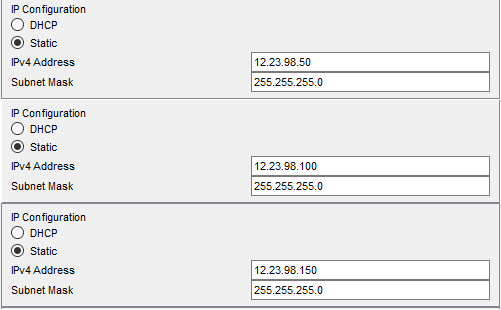

1. Created Enterprise, Data Center, Home Office networks   
.png)
2. Assigned IP adresses for Enterprise network  

3. Assigned IP adresses for Data Center network  

4. Assigned IP adresses for Home Office network  

[Link to the repository](https://github.com/veronika2312/DevOps_online_Kharkiv_2022Q1Q2/tree/main/m3)

Additional task

MAC-адреса відправника: de:d8:1b:49:3d:3a

MAC-адреса отримувача: 9c:b6:54:45:5e:de

IP-адреса відправника: 162.125.72.13

IP-адреса отримувача: 192.163.0.182

TCP-порт відправника: 443

TCP-порт отримувача: 49882

[Link to the repository](https://github.com/veronika2312/DevOps_online_Kharkiv_2022Q1Q2/tree/main/m3)