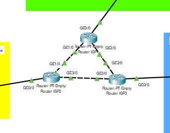
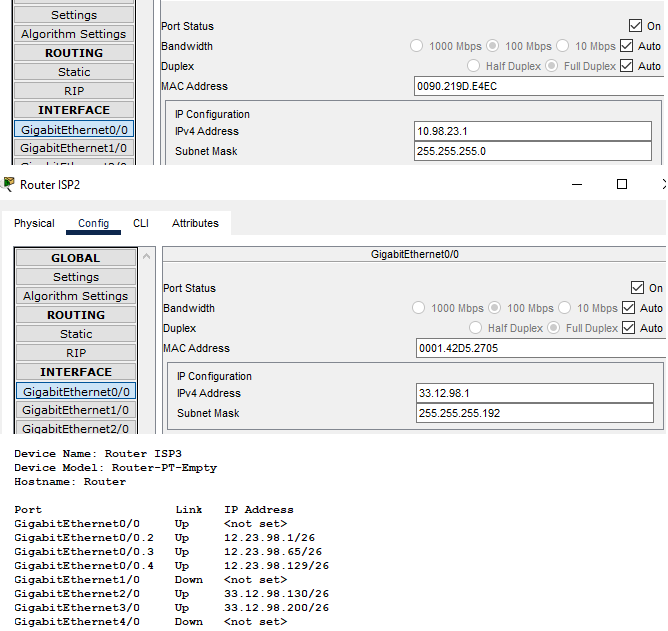
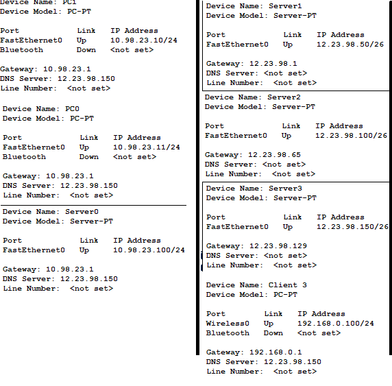
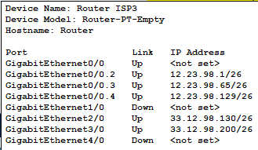

1. Connected networks using GE0/0   

2. Assigned IP-addreses for the routers GE0/0    

3. Assigned default gateway for computers GE0/0    

3. Completed additional task and created subinterfaces    

[Link to the repository](https://github.com/veronika2312/DevOps_online_Kharkiv_2022Q1Q2/tree/main/m3)

