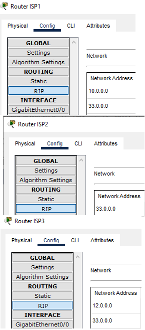
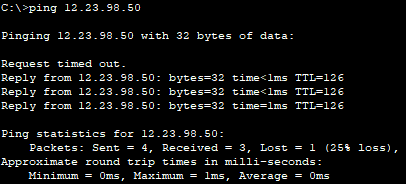
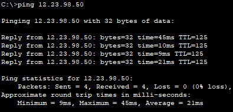

1. Created a RIP routing table    

2. Ping Client1>Web Server1    

3. Ping Client3>Web Server1    

[Link to the repository](https://github.com/veronika2312/DevOps_online_Kharkiv_2022Q1Q2/tree/main/m3)
