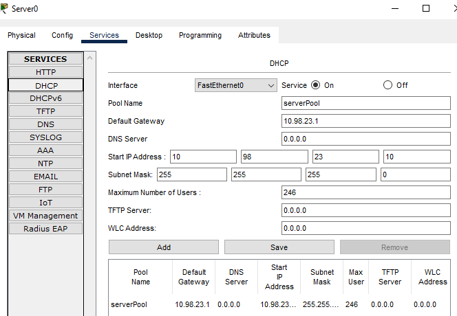
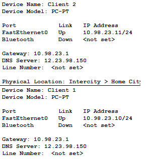
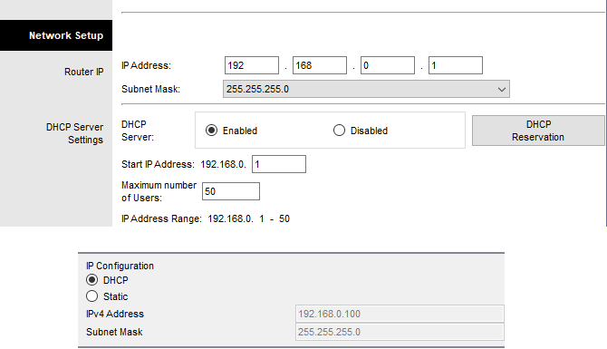
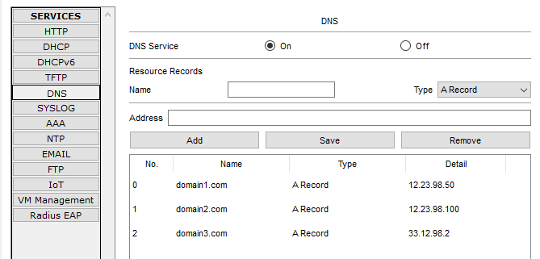
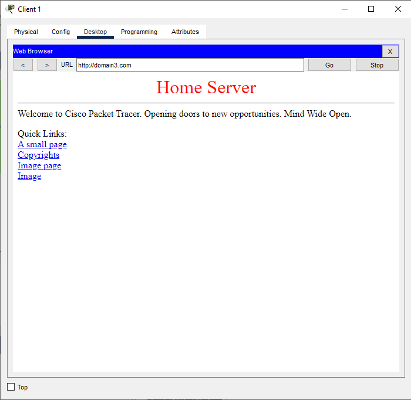

1. DHCP pool is configured   

2. DHCP is working properly on Client 1 and Client 2   

3. DHCP is set on Homerouter and working properly on Client 2   

4. DNS server settings   

Additional task was successfuly completed

[Link to the repository](https://github.com/veronika2312/DevOps_online_Kharkiv_2022Q1Q2/tree/main/m3)
