Task1.Part    
1) Log in to the system as root (or sudo-er).    
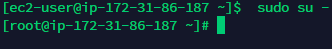  

2) Use the passwd command to change the password. Examine the basic parameters
of the command. What system file does it change *?  
 - Passwd command changes file: /etc/passwd
 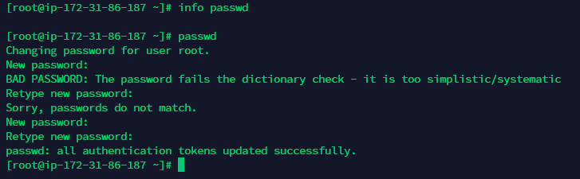  

3) Determine the users registered in the system, as well as what commands they
execute. What additional information can be gleaned from the command execution?   
- Login, Name, Tty, Idle, Login Time, Office, Office Phone, Host.  
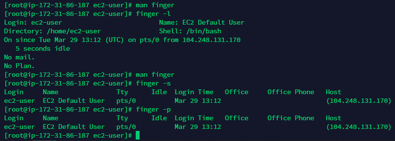   

4) Change personal information about yourself.  
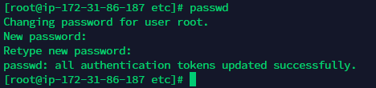   

5) Become familiar with the Linux help system and the man and info commands.
Get help on the previously discussed commands, define and describe any two keys
for these commands. Give examples.  
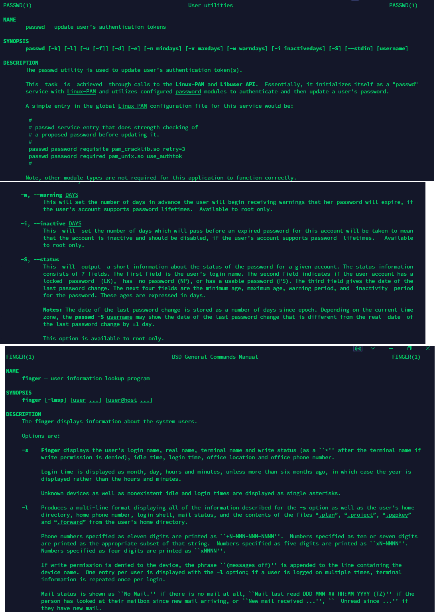   

6) Explore the more and less commands using the help system. View the contents of
files .bash* using commands.  
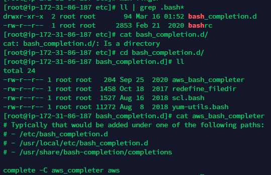   

7) * Determine  the  last  logon  time  for  all  users.Tip:  You  should  read  the documentation for the finger command.  
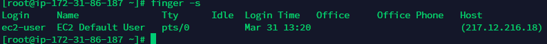   

8) * List the contents of the home directory using the ls command, define its files
and directories. Hint: Use the help system to familiarize yourself with the ls
command.  
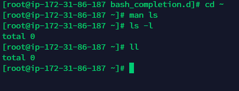   

Task1.Part  

1) Examine the tree command. Master the technique of applying a template, for
example, display all files that contain a character c, or files that contain a specific
sequence of characters. List subdirectories of the root directory up to and including
the second nesting level.  
 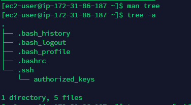  

2) What command can be used to determine the type of file (for example, text or
binary)? - the "file" command. Give an example.   
 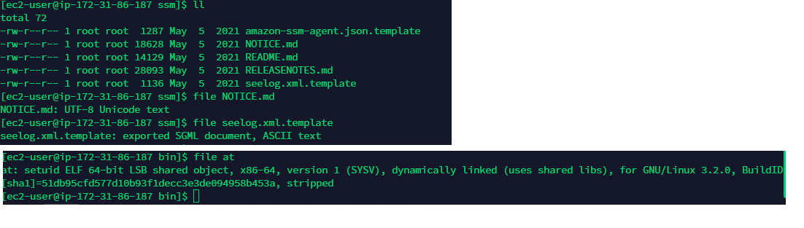  

3) Master the skills of navigating the file system using relative and absolute paths.
How can you go back to your home directory from anywhere in the filesystem? ("cd ~ ")  

4) Become familiar with the various options for the ls command. Give examples of
listing directories using different keys. Explain the information displayed on the
terminal using the -l and -a switches.   
    -a, --all = do not ignore entries starting with .  
    -l = use a long listing format  
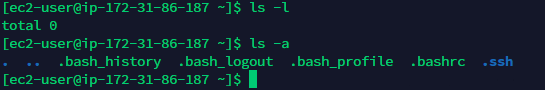  

5) Perform the following sequence of operations:   

- create a subdirectory (subdir) in the home directory;   

- in this subdirectory create a file containing information about directories located in
the root directory (using I/O redirection operations);   
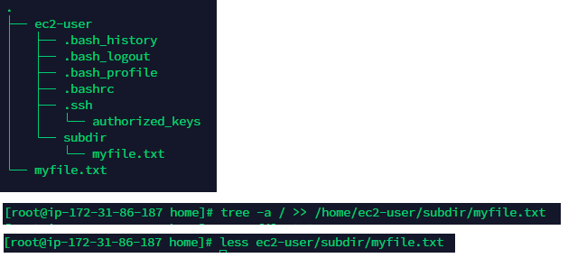  
- view the created file;   

- copy the created file to your home directory using relative and absolute addressing.   
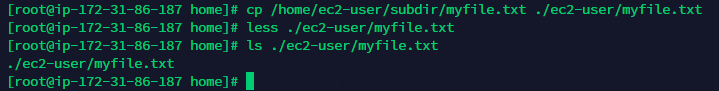  
- delete the previously created subdirectory with the file requesting removal;   
- delete the file copied to the home directory.   
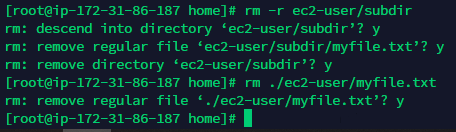  

6) Perform the following sequence of operations:   

- create a subdirectory test in the home directory;   
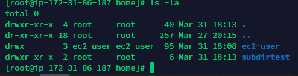  

- copy the .bash_history file to this directory while changing its name to
labwork2;   
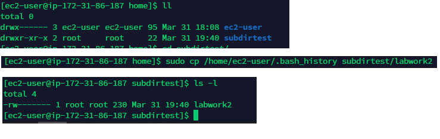  

- create a hard and soft link to the labwork2 file in the test subdirectory;   

- how to define soft and hard link, what do these concepts;  
The difference between hard links and soft (or symbolic) links comes down to what they reference.  
Hard links point, or reference, to a specific space on the hard drive. You can have multiple files hard linked to the same place in the hard drive, but if you change the data on one of those files, the other files will also reflect that change.  
Symbolic links work a bit differently. A symbolic link still points to a specific point on the hard drive, but if you create a second file, this second file does not point to the harddrive, but instead, to the first file. 

- change the data by opening a symbolic link. What changes will happen and why   
If i make changes in the link file, the original file is also changed. 

- rename the hard link file to hard_lnk_labwork2;   
- rename the soft link file to symb_lnk_labwork2 file;   
- then delete the labwork2. What changes have occurred and why?   
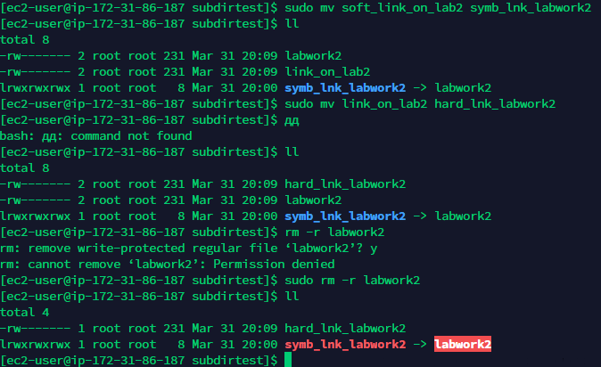  

7) Using the locate utility, find all files that contain the squid and traceroute
sequence.   

  

8) Determine which partitions are mounted in the system, as well as the types of
these partitions.   
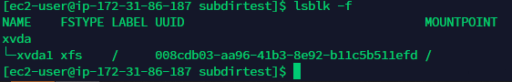  

9) Count the number of lines containing a given sequence of characters in a given
file.   
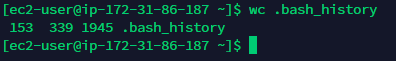  

10) Using the find command, find all files in the /etc directory containing the host
character sequence.   
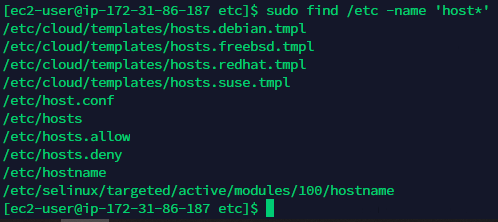  

11) List all objects in /etc that contain the ss character sequence.   
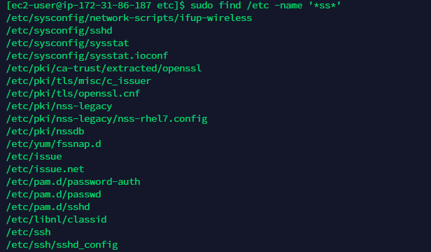  
How can I duplicate a similar command using a bunch of grep?   
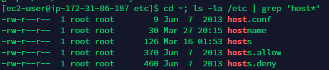  
12) Organize a screen-by-screen print of the contents of the /etc directory. Hint: You
must use stream redirection operations.   
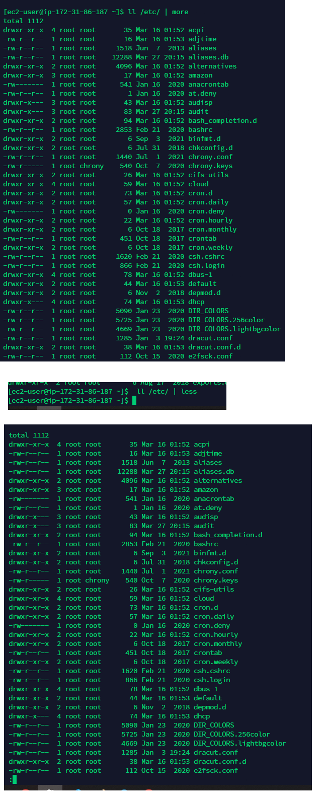  

13) What are the types of devices and how to determine the type of device? Give
examples.   

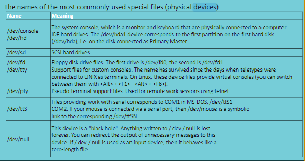  

14) How to determine the type of file in the system, what types of files are there?   
- Linux supports seven different types of files. These file types are the Regular file, Directory file, Link file, Character special file, Block special file, Socket file, and Named pipe file.  
1. The simplest file command is as follows where you just provide a file whose type you want to find out. ($ file etc) 
2. You can also pass the names of the files to be examined from a file (one per line), which you can specify using the -f flag as shown. ($ file -f files.list
)  
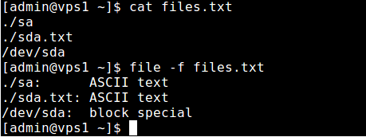  

15) * List the first 5 directory files that were recently accessed in the /etc directory.   
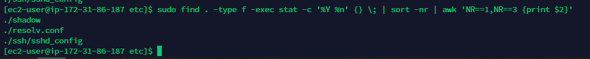  

