Task2   
Task assignment.  
1) Analyze the structure of the /etc/passwd and /etc/group file, what fields are present in it, what users exist on the system? Specify several pseudo-users, how to define them?  
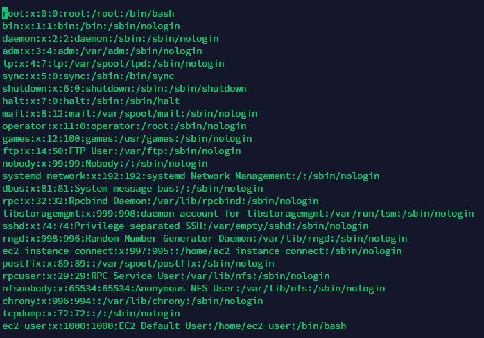  
The /etc/passwd contains one entry per line for each user (user account) of the system.  

All fields are separated by a colon (:) symbol. File consists of seven fields:  

Username: It is used when user logs in. It should be between 1 and 32 characters in length.  

Password: An x character indicates that encrypted password is stored in /etc/shadow file.  

User ID (UID): Each user must be assigned a user ID (UID). UID 0 (zero) is reserved for root and UIDs 1-99 are reserved for other predefined accounts. Further UID 100-999 are reserved by system for administrative and system accounts/groups.  

Group ID (GID): The primary group ID (stored in /etc/group file)  

User ID Info (GECOS): The comment field. It allow you to add extra information about the users such as user’s full name, phone number etc. This field use by finger command.  

Home directory: The absolute path to the directory the user will be in when they log in. If this directory does not exists then users directory becomes /  

Command/shell: The absolute path of a command or shell (/bin/bash). Typically, this is a shell.  

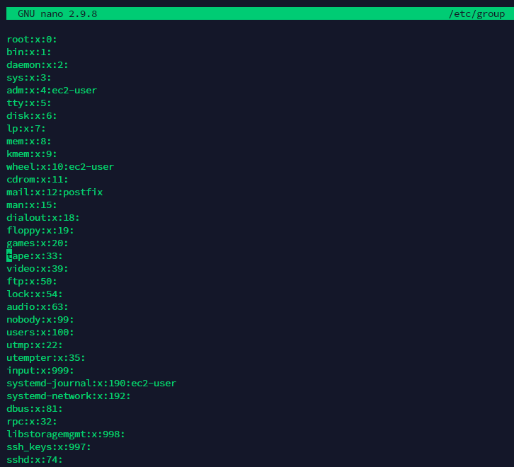  
File consists of four fields:  
group_name: It is the name of group.   
Password: Generally password is not used, hence it is empty/blank. It can store encrypted password.  
Group ID (GID): Each user must be assigned a group ID. You can see this number in your /etc/passwd file.   
Group List: It is a list of user names of users who are members of the group. The user names, must be separated by commas.    

2) What are the uid ranges? What is UID? How to define it?   
Distributions generally split the available UID range in two:   

1…999 → System users. These are users that do not map to actual “human” users, but are used as security identities for system daemons, to implement privilege separation and run system daemons with minimal privileges.    

1000…65533 and 65536…4294967294 → Everything else, i.e. regular (human) users.    

3) What is GID? How to define it?   
Groups in Linux are defined by GIDs (group IDs). Just like with UIDs, the first 100 GIDs are usually reserved for system use.   
The GID of 0 corresponds to the root group and the GID of 100 usually represents the users group. GIDs are stored in the /etc/groups file.  
 New groups are usually assigned GIDs starting from 1000.   

4) How to determine belonging of user to the specific group?  
Just using the groups command by itself like that shows you the groups to which the currently logged in user belongs.  

You can also add a username after the groups command if you’re investigating group membership for a different account.    
 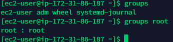  
5) What are the commands for adding a user to the system? What are the basicparameters required to create a user?   

6) How do I change the name (account name) of an existing user?   
usermod -l login-name old-name = use the usermod command in Linux to rename user account. The name of the user will be changed from the old-name to login_name. Nothing else is changed. The user’s home directory name should probably be changed to reflect the new login name.   

7) What is skell_dir? What is its structure?  
Directory /etc/skel/ (skel is derived from the “skeleton”) is used to initiate home directory when a user is first created.
 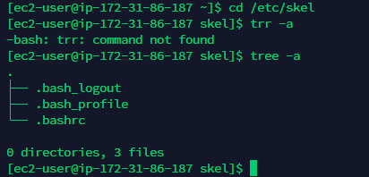  

8) How to remove a user from the system (including his mailbox)?   
 Use the -r (--remove) option to force userdel to remove the user’s home directory and mail spool    
   

9) What commands and keys should be used to lock and unlock a user account?   
- To lock a user with the passwd command, you can use the option -l or –lock in this manner:   
 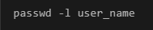  

- To unlock the user with passwd command, you can use the option -u or –unlock:  
 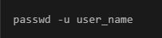  

10) How to remove a user's password and provide him with a password-freelogin for subsequent password change?   

   - sudo passwd -d [username] - deletes a user's password (make it empty). This is a quick way to disable a password for an account. It will set the named account passwordless.   
   - sudo passwd -e [username] - immediately expires an account's password. This in effect can force a user to change their password at the user's next login.   

11) Display the extended format of information about the directory, tell about the information columns displayed on the terminal.  
The information we get from stat:  

File: The name of the provided file. If the provided file is a symlink, then the name will be different.   
Size: The size of a given file in Bytes.  
Blocks: Total number of allocated blocks to the file to store on the hard disk.  
IO Block: The size of every allocated block in bytes.  
File type: The file may be of the following types: Regular files, special files, directories, or symbolic links.  
Device: Device number in hexadecimal format.  
Inode: Inode number of the file.  
Links: Number of hard links of the file.  
Access: Access permissions in the numeric and symbolic methods.  
Context: The field stores SELinux security context.  
Access: The last time at which the file was accessed.  
Modify: The last time at which file was modified.  
Change: The last time the at which file’s attribute or content was changed.  
Birth: The time at which the file was created.  
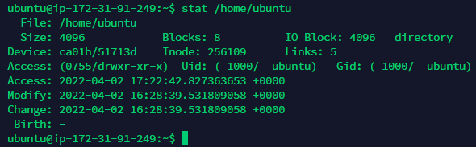  

12) What access rights exist and for whom (i. e., describe the main roles)?   
- Standart permissions for: user:group:other is "chmod 640" 
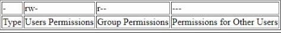  
Briefly describe the acronym for access rights.   
The command chown /ˈtʃoʊn/, an abbreviation of change owner, is used on Unix and Unix-like operating systems to change the owner of file system files, directories.    

13) What is the sequence of defining the relationship between the file and the user?   

This information is kept in inode, you can find the inode number by using ls -i [name of the file] command.   
 You can find more information by using the command stat [path of the file or dir.]   
 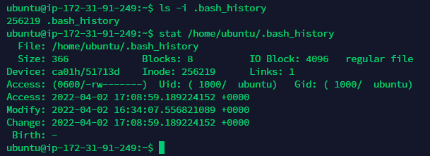  

14) What commands are used to change the owner of a file (directory), as well as the mode of access to the file? Give examples, demonstrate on the terminal.   
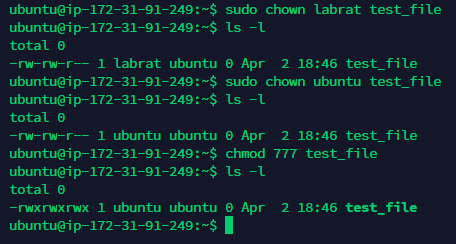  

15) What is an example of octal representation of access rights? Describe the umask command.  

0 [---] No permissions   
1 [--x] Execute permission only   
2 [-w-] Write permission only   
3 [-wx] Write and execute permissions  
4 [r--] Read permission only    
5 [r-x] Read and execute permissions   
6 [rw-] Read and write permissions  
7 [rwx] Read, write, and execute permissions   

- umask command is used to assign the default file permission sets for newly created folders and files.   

16) Give definitions of sticky bits and mechanism of identifier substitution. Givean example of files and directories with these attributes.  
A Sticky bit is a permission bit that is set on a file or a directory that lets only the owner of the file/directory or the root user to delete or rename the file. No other user is given privileges to delete the file created by some other user.  

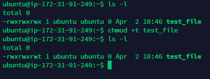  

17) What file attributes should be present in the command script? - Execution attribute (x). 
