Part 1.    
1. How many states could has a process in Linux?   
In Linux, a process is an instance of executing a program or command. While these processes exist, they’ll be in one of the five possible states:   

Running or Runnable (R)  
Uninterruptible Sleep (D)  
Interruptable Sleep (S)  
Stopped (T)  
Zombie (Z)  
- 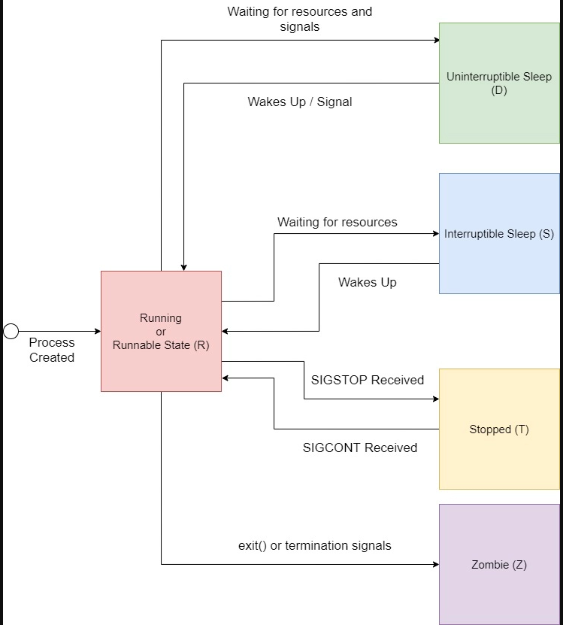  

2. Examine the pstree command. Make output (highlight) the chain (ancestors) of the currentprocess.   
- 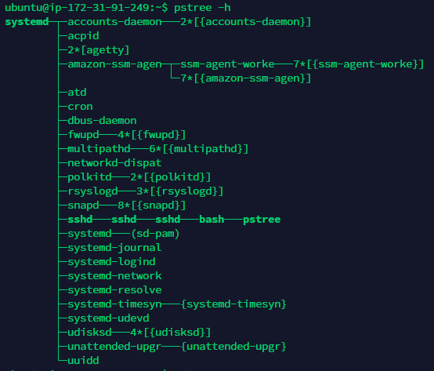  

3. What is a proc file system?   
Proc file system (procfs) is virtual file system created on fly when system boots and is dissolved at time of system shut down.

It contains useful information about the processes that are currently running, it is regarded as control and information center for kernel.

4. Print information about the processor (its type, supported technologies, etc.).   
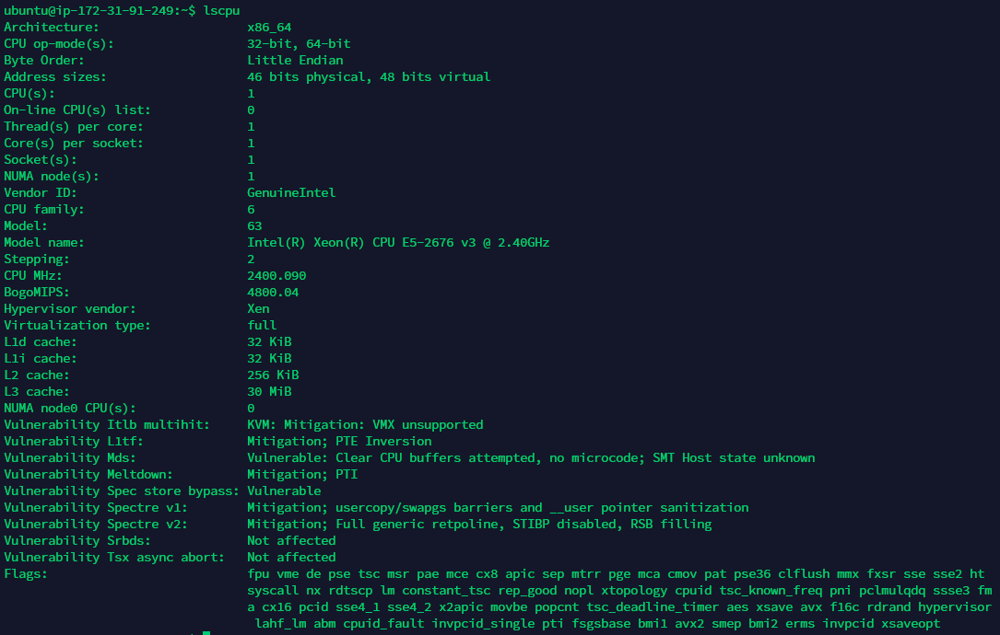  

5. Use the ps command to get information about the process. The information should be as follows: the owner of the process, the arguments with which the process was launched for execution, the group owner of this process, etc.   
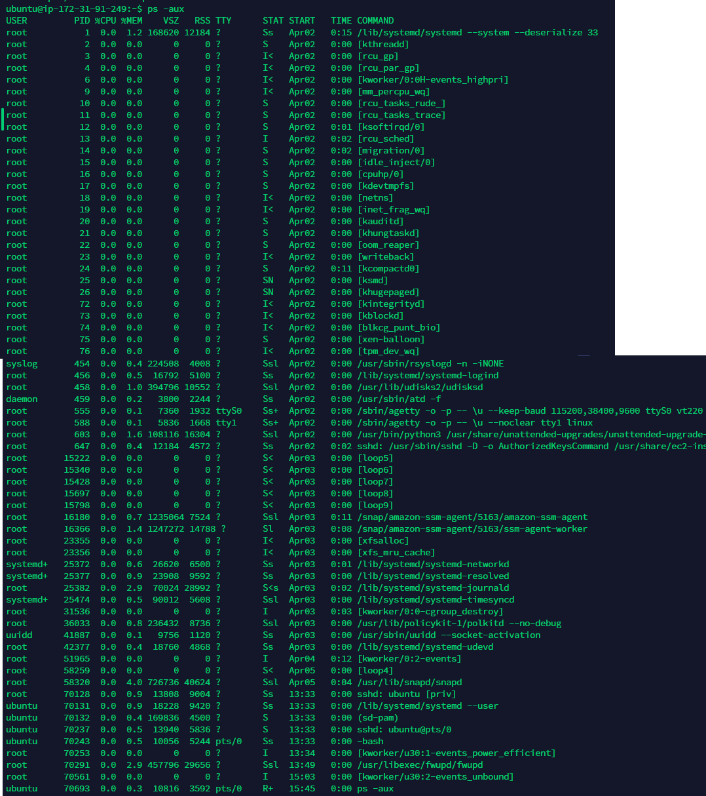  

6. How to define kernel processes and user processes?   
User-space processes have its own virtual address space. Kernel processes or threads do not have their own address space, they operate within kernel address space only  

7. Print the list of processes to the terminal. Briefly describe the statuses of the processes. What condition are they in, or can they be arriving in?   
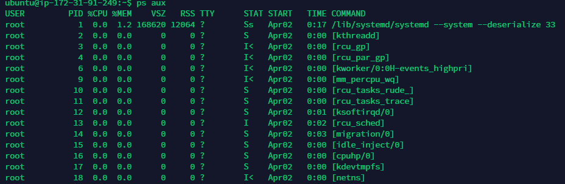  
  For BSD formats and when the stat keyword is used, additional characters may be displayed:  
s --> is a session leader  
l --> is multi-threaded (using CLONE_THREAD, like NPTL pthreads do)  
I --> means “idle”. This state was introduced in version 4.14 of the Linux kernel, in September 2017. It is used for kernel threads which use the TASK_IDLE state when idling, instead of TASK_INTERRUPTIBLE; in previous versions of the kernel, such threads were reported as TASK_UNINTERRUPTIBLE which was confusing.  
S --> Interruptible sleep(S) process which is waiting for an event to complete.  
Ss --> A session leader(s) process in Interruptible sleep(S).  
SN --> A low priority(N) process is in interruptible sleep(S).  
S< s --> "<" indicates a high priority process and the process is a session leader(s) in interruptible sleep(S).  
S< sl --> A multhi-threaded(l) high priority(<) session leader(s) process in interruptible sleep(S).  
S< --> A high priroty(<) process in interruptible sleep(S).  
SNl --> A low priority(N) multi-threaded(l) process in interruptible sleep(S) state.  
SNs --> A low priority(N) session leader(s) process in interruptible sleep(S).  
SN+ --> A low priority(N) interruptible sleep(S) process running in foreground(+).  
R+ --> A foreground(+) running(R) process.  

8. Display only the processes of a specific user.   
 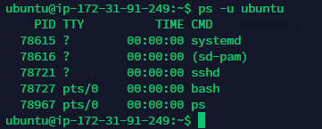  

9. What utilities can be used to analyze existing running tasks (by analyzing the help for the ps command)?   
 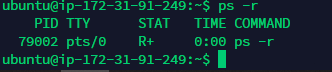  

10. What information does top command display?   
top command - can display system summary information as well as a list of processes or threads currently being managed by the Linux kernel.  The types  of  system  summary  information shown and the types, order and size of information displayed for processes are all user configurable and that configuration can be made persistent across restarts. 

11. Display the processes of the specific user using the top command.   
 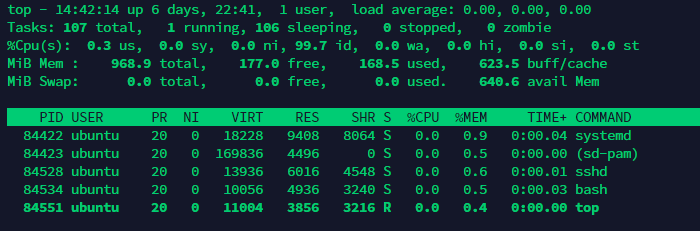  

12. What interactive commands can be used to control the top command? Give a couple of examples.   

<Enter> or <Space>  --> Refresh-Display. These commands awaken top, and following receipt of any input, the entire display is repainted. They also force an update of any hotplugged cpu or physical memory changes.  

? or h --> 	Help. There are two help levels available. The first provides a reminder of all the basic interactive commands. If top is secured, that screen is abbreviated. Typing 'h' or '?' on that help screen takes you to help for those interactive commands applicable to alternate-display mode.  

= --> Exit-Task-Limits. Removes restrictions on which tasks are shown.  

'U' or 'u' -->  interactive commands regarding user filtering. Additionally, any window that was scrolled is reset with this command.  

A --> Alternate-Display-Mode toggle. This command switches between full-screen mode and alternate-display mode.  

B --> 	Bold-Disable/Enable toggle. This command influences use of the 'bold' terminfo capability and alters both the summary area and task area for the current window. While it is intended primarily for use with dumb terminals, it can be applied anytime.   

d or s --> Change-Delay-Time-interval. You are prompted to enter the delay time, in seconds, between display updates. Fractional seconds are honored, but a negative number is not allowed. Entering 0 causes (nearly) continuous updates, with an unsatisfactory display as the system and tty driver try to keep up with top's demands. The delay value is inversely proportional to system loading, so set it with care. If at any time you want to know the current delay time, ask for help and view the system summary on the second line.   

g --> Choose-Another-Window/Field-Group. You are prompted to enter a number between 1 and 4 designating the field group which should be made the current window. You soon grow comfortable with these 4 windows, especially after experimenting with alternate-display mode.   

H --> Threads-mode toggle. When this toggle is On, individual threads are displayed for all processes in all visible task windows. Otherwise, top displays a summation of all threads in each process.   

I --> IRIX/Solaris-Mode toggle. When operating in 'Solaris mode' ('I' toggled Off), a task's cpu usage is divided by the total number of CPUs. After issuing this command, you are told the new state of this toggle.    

k -->  Kill-a-task. You are prompted for a PID and then the signal to send. The default signal, as reflected in the prompt, is SIGTERM. However, you can send any signal, via number or name. If you want to abort the kill process, do one of the following depending on your progress:    

1) At the pid prompt, press Enter.   

2) At the signal prompt, type 0.  

q --> 	Quit   

r --> 	 Renice-a-Task. You are prompted for a PID and then the value to nice. Entering a positive value causes a process to lose priority. Conversely, a negative value cause sa process to be viewed more favorably by the kernel.   

W --> 	Write-the-Configuration-File. This key saves all your options and toggles, plus the current display mode and delay time. By issuing this command before quitting top, you can restart later in exactly that same state.   

Z --> 	Change-Color-Mapping. This key takes you to a separate screen where you can change the colors for the current window, or for all windows. For details regarding this interactive command, see topic 4d. COLOR Mapping.    

13. Sort the contents of the processes window using various parameters (for example, the amount of processor time taken up, etc.)   
 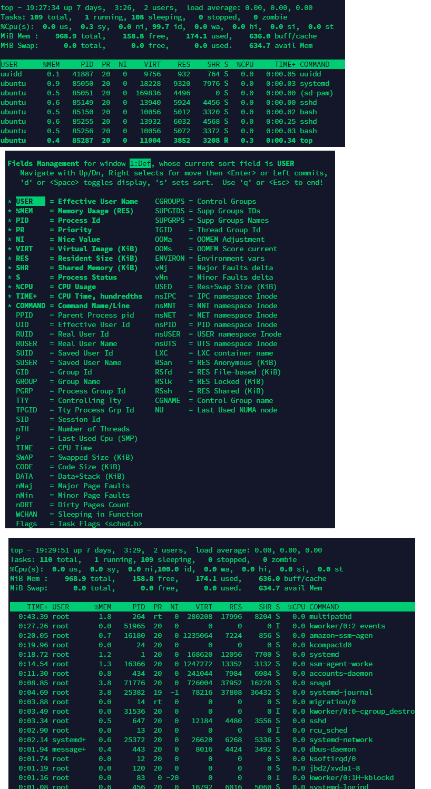  

14. Concept of priority, what commands are used to set priority? - Nice/renice  

15. Can I change the priority of a process using the top command?If so, how?   
Once given top command, press r. Give PID value of the process you want to change the process value. Give renice value (from -20 to +19)  

Nice value of -20 means highest priority value and +19 means lowest priority value. 0 is by default value.  

Don't confuse renice value (-20 to +19) with process value (0 to 39)  

relation between nice value and priority is : PR = NI + 20  

16. Examine the kill command. How to send with the kill command process control signal? Give an example of commonly used signals.   
 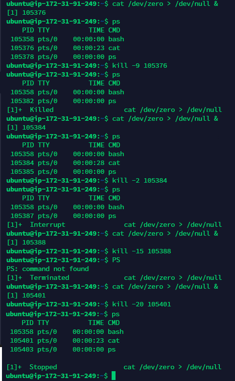  

17. Commands jobs, fg, bg, nohup. What are they for? Use the sleep, yes command to demonstrate the process control mechanism with fg, bg.   
Jobs command is used to list the jobs that you are running in the background and in the foreground.  
Fg command moves a background process on your current Linux shell to the foreground.  
Bg is a job control command. It resumes suspended jobs in the background, returning the user to the shell prompt while the job runs.    
Nohup (No Hang Up) is a command in Linux systems that runs the process even after logging out from the shell/terminal.   
 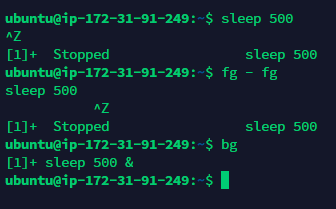  

Part2   
1. Check the implementability of the most frequently used OPEN SSH commands in the MS Windows operating system. (Description of the expected result of the commands +screenshots: command –result should be presented)   
scp - Secure copy (remote file copy program)   
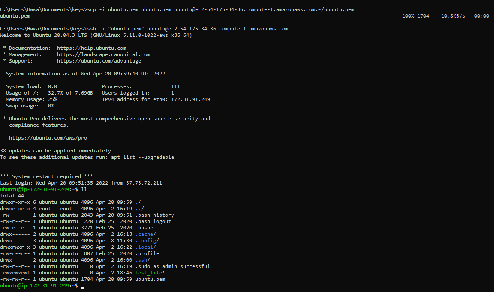  
sftp - Secure file transfer program    
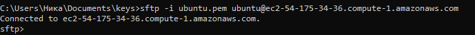  
ssh - OpenSSH client (remote login program)   
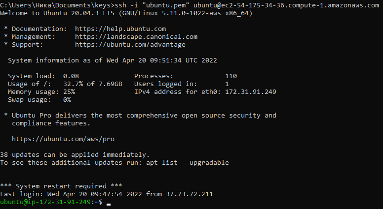  
ssh-agent - Authentication agent   
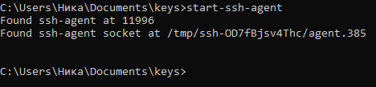  
ssh-keygen - Authentication key generation, management, and conversion   
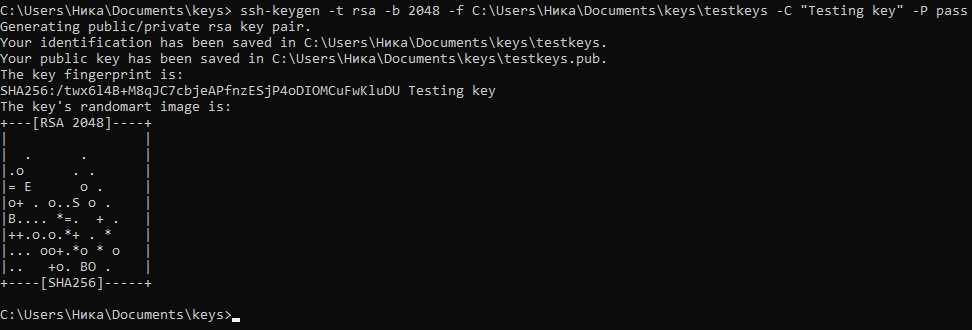  
ssh-keyscan - Gather ssh public keys   
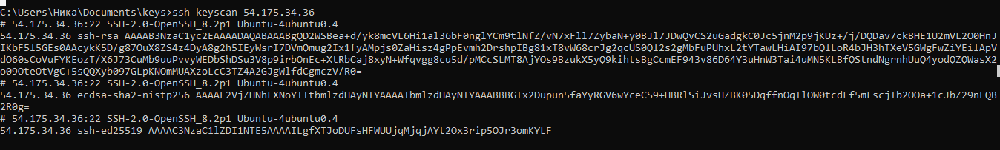  
sshd - OpenSSH daemon   
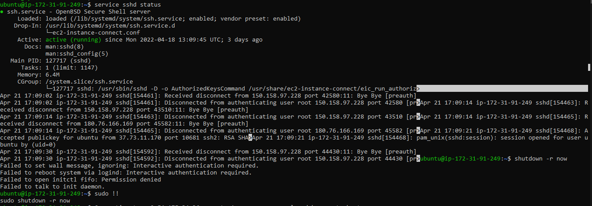  

2. Implement basic SSH settings to increase the security of the client-server connection (at least)   
Created a pass-phrase for the server private key   
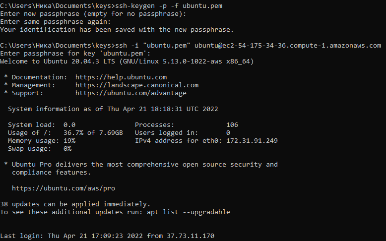  

3. List the options for choosing keys for encryption in SSH. Implement 3 of them.   
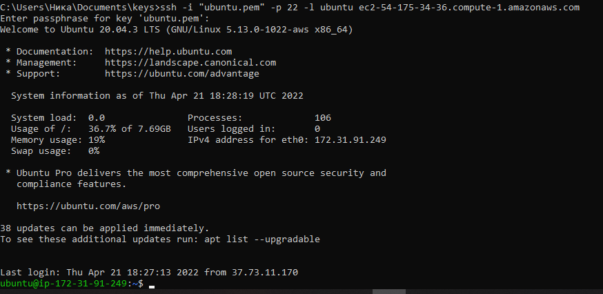  

4. Implement port forwarding for the SSH client from the host machine to the guest Linux virtual machine behind NAT.
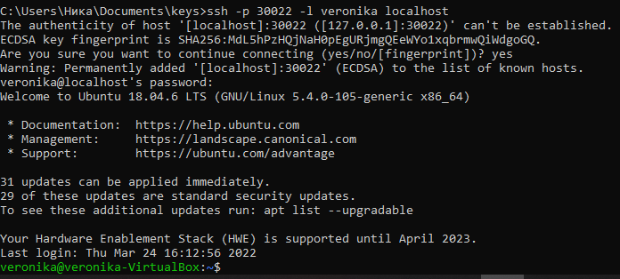  

5*. Intercept (capture) traffic (tcpdump, wireshark) while authorizing the remote client on theserver using ssh, telnet, rlogin. Analyze the result.    

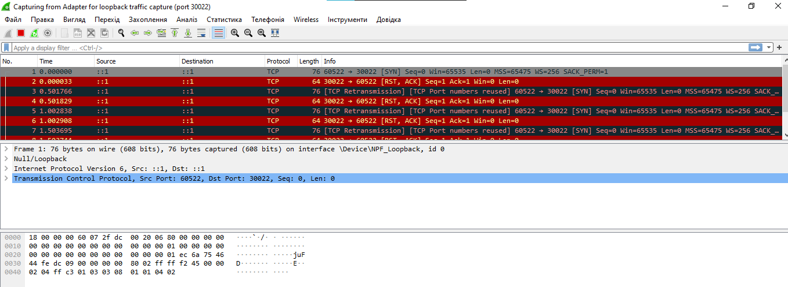  