   1. Assigned ststic IP-address for Net2 and Net3 networks on Server_1   
 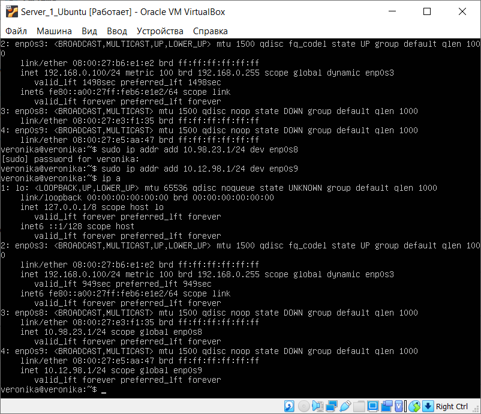  
 2. Configured DHCP-servise on Server_1, that will configure Int1 addresses,
Client_1 and Client_2.  
 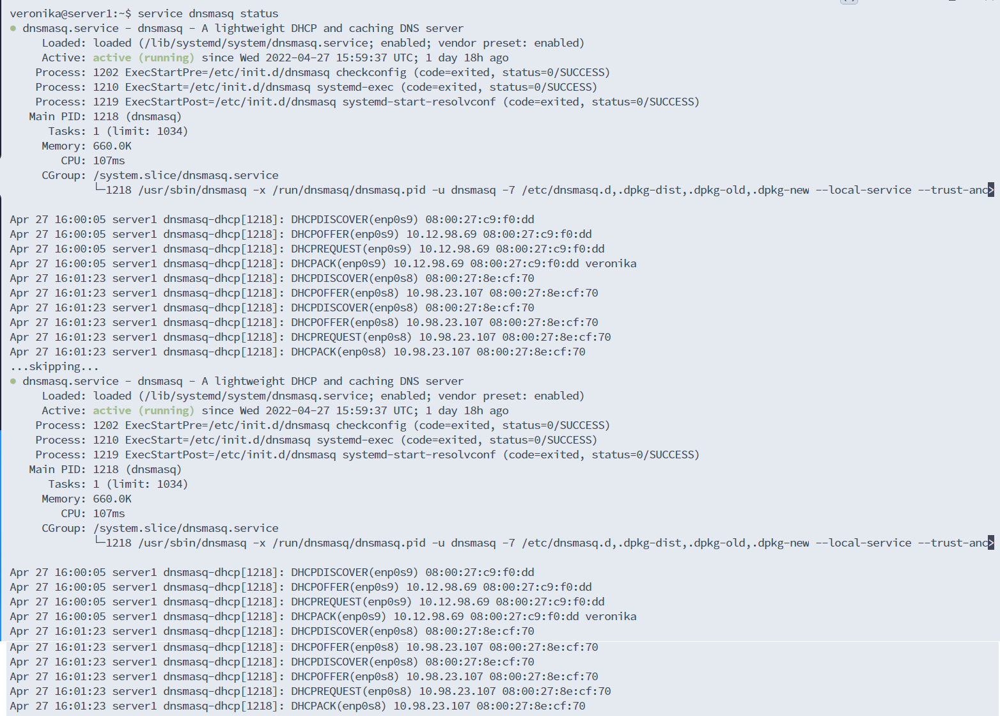  
 3. Checked the connections between VMs and Server_1 using ping and traceroute.  
  Traceroute needs only one hop, because Clients and Server_1 are connected directly.  
Ping Client 1 > Client 2   
  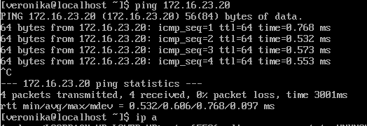  

Ping Client 2 > Client 1   
  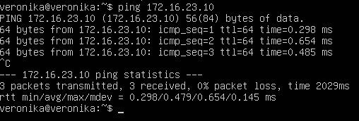  

Ping Server_1 > Client 1   
  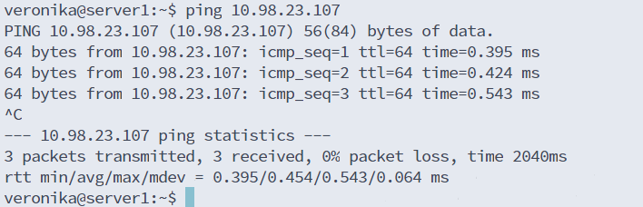  

Ping Server_1 > Client 2   
  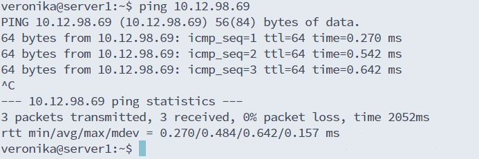  
4. This task I divided into following steps:  
1) Assigned IP addresses for Client_1 lo:  
  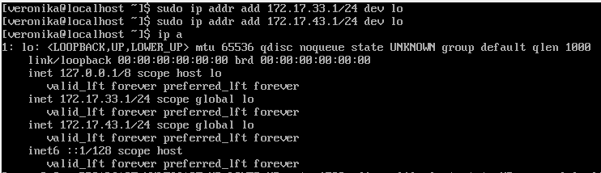  
2) Assigned gateways for Client_2 in routing table:  
  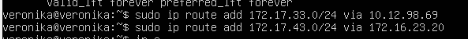  
3) Added a note about о 172.17.33.1 to the routing table on Server_1:  
  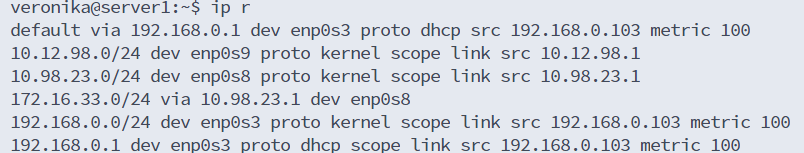   
4) Checked routing using traceroute utility:  
  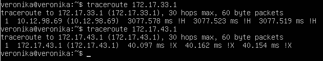   
  
5. Converted ip addresse into bin and calculated common mask and net address.   
  172.17.33.1 - 10101100.00010001.0010|0001.00000001   
  172.17.43.1 - 10101100.00010001.0010|1011.00000001   
Common net and mask: 172.17.32.0/20   
Added a route to the route table on Server_1    
 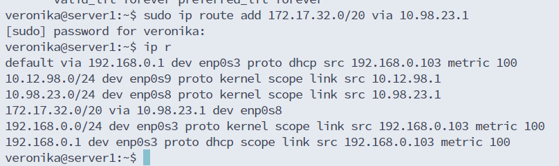  

 6. Client 1 - Server_1  
    
 Client 2 - Server_1   
 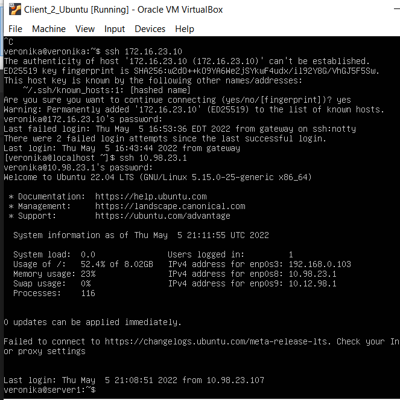   
  Client 1 - Client_2
    
 Client 2 - Client_1  
    

 7. Firewall is configured:  
 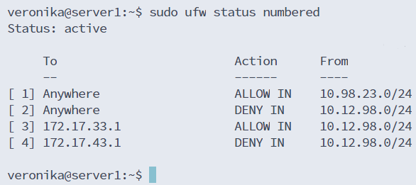   

 8. Ping is working properly:  
  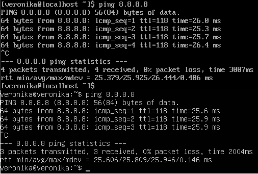  

