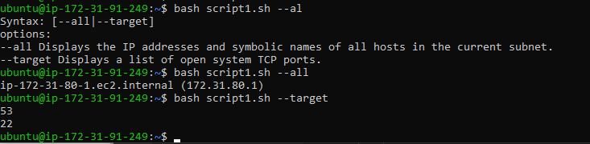
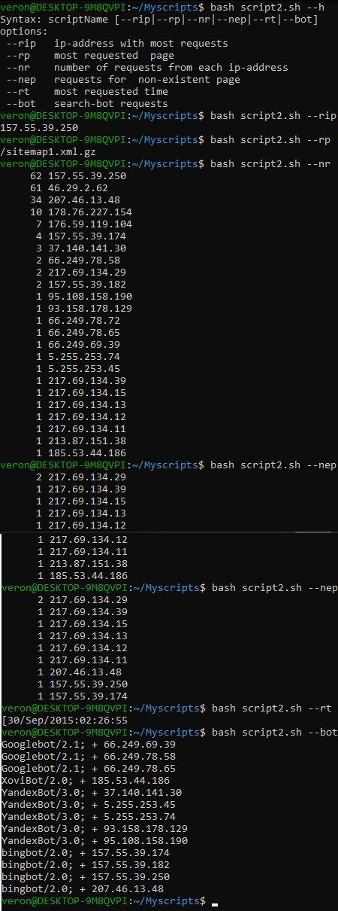
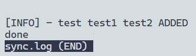

A.   

#!/bin/bash   

######################################################   
Help()   
{  
        # Display Help   
        echo "Syntax: scriptTemplate [--all|--target]"   
        echo "options:"   
        echo "--all Displays the IP addresses and symbolic names of all hosts in the current subnet."   
        echo "--target Displays a list of open system TCP ports."  
}  
  
All()    
{    
        # Display --all    
        result=`arp -a | awk '{print $1; print $2}'`    
        echo $result   
}   
  
Target()    
{   
        # Display --target     
        printf "%s\n" `ss -tulpn | grep "tcp" | awk '{print $5}' | awk -F: '{print $2}'`       
        # echo $target       
}        
  
case $1 in          
        --all)          
        All           
        ;;            
        --target)             
        Target             
        ;;               
        *)                
        Help                 
        ;;                  
esac                  
  
Script works properly:                   
                    
  
B.   
  
#!/bin/bash   
  
Help()  
{  
        # Display Help   
        echo "Syntax: scriptName [--rip|--rp|--nr|--nep|--rt|--bot]"   
        echo "options:"   
        echo " --rip   ip-address with most requests"   
        echo " --rp    most requested  page"   
        echo " --nr    number of requests from each ip-address "   
        echo " --nep   requests for  non-existent page "   
        echo " --rt    most requested time "   
        echo " --bot   search-bot requests "   
}  
  
rip()   
{  
        #  Display --rip ip-address with most requests  
        cat logex.txt | awk '{print $1}' | sort -n |  uniq -c | sort -nr | awk 'NR==1{print $2}'  
         
}  
 
rp()  
{  
        #  Display --rp  most requested  page  
        cat logex.txt | awk '{print $7}' | sort -n |  uniq -c | sort -nr | awk 'NR==1{print $2}'  
}  
  
nr()  
{  
        #  Display --nr   number of requests from each ip-address  
 
        cat logex.txt | awk '{print $1}' | sort -n |  uniq -c | sort -nr  
 
}  
 
nep()  
{  
        #  Display --nep requests for  non-existent page  
        awk '{ if($9 != 200) { print $1 } }' logex.txt | sort | uniq -c | sort -nr  
 
}  
 
rt()  
{  
        #  Display --rt most requested time  
        cat logex.txt | awk '{print $4}' | sort -n |  uniq -c | sort -nr |  awk 'NR==1{print $2}'  
 
}  
 
bot()  
{  
        #  Display --bot search-bot requests  
        grep "bot" -F logex.txt | awk '{ print $14 " + " $1 }' | grep "[b,B]ot" | sort | uniq  
 
}  
 
 
 
case $1 in  
        --rip)  
        rip  
        ;;  
        --rp)  
        rp  
        ;;  
        --nr)  
        nr  
        ;;  
        --nep)  
        nep  
        ;;  
        --rt)  
        rt  
        ;;  
        --bot)  
        bot  
        ;;  
        --h)    Help  
esac  
 
Script works properly:                   
   
 
C.  
#!/bin/bash  
 
logfile="/home/veron/sync.log"  
filename_added=`diff -q /home/veron/Myscripts/ /home/veron/Myscriptsync/ | awk '/Only in \/home\/veron\/Myscripts\// {print $4}'`  
filename_deleted=`diff -q /home/veron/Myscripts/ /home/veron/Myscriptsync/ | awk '/Only in \/home\/veron\/Myscriptsync\// {print $4}'`  
if [[ -n $filename_deleted ]]  
then  
    result="[INFO] "  
    result+=`date "+%D %R"`  
    result+=" - "  
    result+=$filename_deleted  
    result+=" DELETED"  
    # Put here a method of file deletion  
    echo $result >> $logfile  
fi  
if [[ -n $filename_added ]]  
then  
    result="[INFO] "  
    result+=`date "+%D %R"`  
    result+=" - "  
    result+=$filename_added  
    result+=" ADDED"  
    # Put here a method of file addition  
    echo $result >> $logfile  
fi  
 
rsync -au --delete "/home/veron/Myscripts/" "/home/veron/Myscriptsync/"  
 
Script works properly:                  
   

