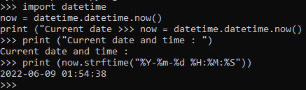
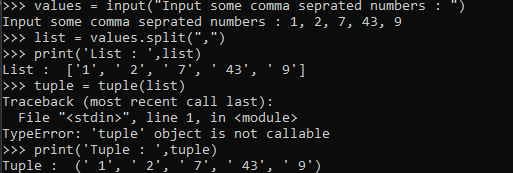
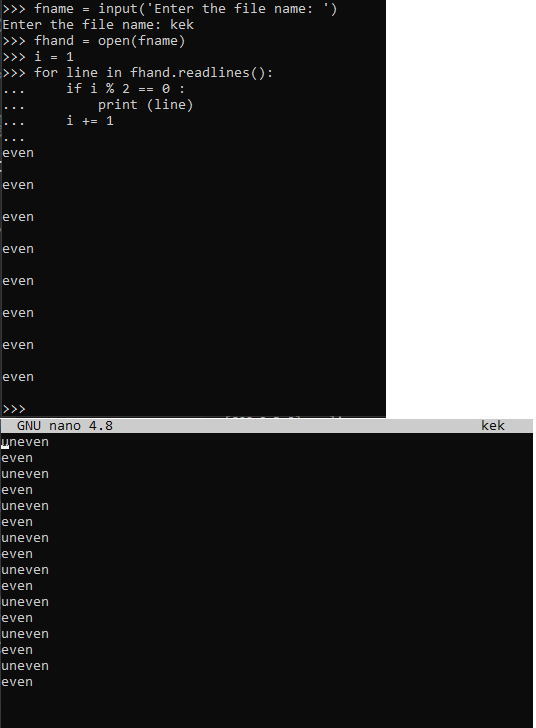
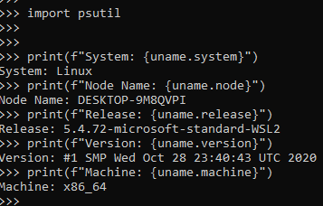

1. Write easy program, which will display current date and time.   
Program:   
  
import datetime  
now = datetime.datetime.now()  
print ("Current date and time : ")  
print (now.strftime("%Y-%m-%d %H:%M:%S"))  
  
Output:   
   
  
2. Write python program, which will accept comma-separated numbers, and then it  
should write tuple and list of them:  
Enter numbers: 1, 2, 7, 43, 9  
Output:  
List: [‘1’, ‘2’, ‘7’, ‘43’, ‘9’]  
Tuple: (‘1’, ‘2’, ‘7’, ‘43’, ‘9’)    
  
Program:   
  
values = input("Input some comma seprated numbers : ")  
list = values.split(",")  
print('List : ')  
tuple = tuple(list)  
print('Tuple : ')  
  
Output:   
   
  
3. Write python program, which will ask file name. File should be read, and only even
lines should be shown.  
  
Output + file:   
       
  
  
4. Write python program, which should read html document, parse it, and show it’s
title.  
  
from html.parser import HTMLParser  
class Parser(HTMLParser):  
  # method to append the start tag to the list start_tags.  
  def handle_starttag(self, tag, attrs):  
    global start_tags  
    start_tags.append(tag)  
    # method to append the end tag to the list end_tags.    
  def handle_endtag(self, tag):  
    global end_tags  
    end_tags.append(tag)  
  # method to append the data between the tags to the list all_data.  
  def handle_data(self, data):  
    global all_data  
    all_data.append(data)  
  # method to append the comment to the list comments.  
  def handle_comment(self, data):  
    global comments  
    comments.append(data)  
start_tags = []  
end_tags = []  
all_data = []  
comments = []  
# Creating an instance of our class.  
parser = Parser()    
# Poviding the input.  
parser.feed('<html><title>Desserts</title><body>
'  
            'I am a fan of frozen yoghurt.
<'  
            '/body><!--My first webpage--></html>')  
print("start tags:", start_tags)  
print("end tags:", end_tags)  
print("data:", all_data)  
print("comments", comments)  
  
5. Write python program, which will parse user’s text, and replace some emotions with
emoji’s (Look: pip install emoji) import emoji  
  
>> print(emoji.emojize('Python is :thumbs_up:'))    
Python is 👍  
>> print(emoji.emojize('Python is :thumbsup:', language='alias'))    
Python is 👍  
>> print(emoji.demojize('Python is 👍'))    
Python is :thumbs_up:  
>>> print(emoji.emojize("Python is fun :red_heart:"))  
Python is fun ❤  
>>> print(emoji.emojize("Python is fun :red_heart:", variant="emoji_type"))   
Python is fun ❤️ #red heart, not black heart  
>>> print(emoji.is_emoji("👍"))  
True  

  

6. Write program, that will show basic PC information (OS, RAM amount, HDD’s, and 
etc.)   
       
   